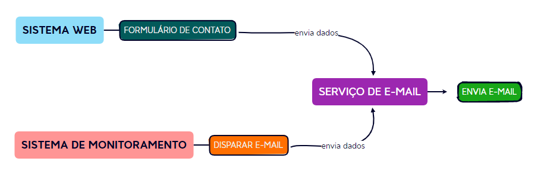

## Serviço de E-mail

- Serviço para centralizar a configuração de envio de e-mails, possibilitando usar em sistemas internos.

### Representação

### Configuração

- renomeie o arquivo **/app.config/email.example.ini** para **/app.config/email.ini**
- preencha os dados de configuração da conta de e-mail

### Gerar Senha

- Utilize este site para gerar senha [Link](https://www.base64encode.org/)

### Rotas

- Teste de aplicação : sistema ativo

~~~
/              GET
~~~

- Teste de envio de e-mail : sistema  enviando
~~~
/send/test      POST
~~~

- Enviar e-mail : enviar e-mail
~~~
/send      POST    
~~~

